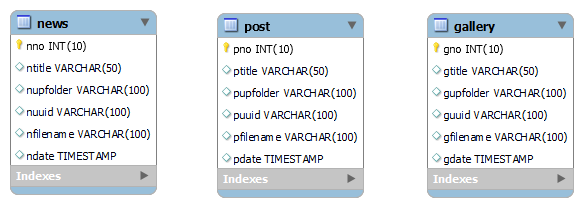
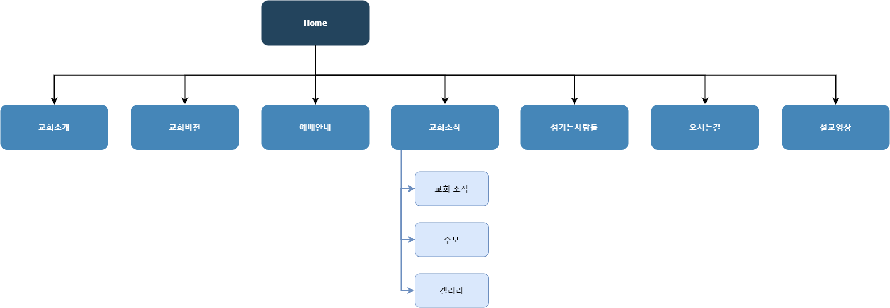

## 1. Introduction

나라가임하는교회 홈페이지입니다. 운영에 어려움이 있는 개척교회를 돕기 위해 봉사 목적으로 개발되었습니다.
 
링크 : http://heaveniscoming.org

  

## 2. Tech Stack

- Backend : Java 8
- DBMS : MariaDB 10.0
- Template engine : JSP 2.3
- IDE : Eclipse
- Deployment : Tomcat 8.5, CentOS 7
- Collaboration tool : Zoom, Notion, Google Workspace

  

## 3. ERD

- 교회소식, 주보, 갤러리 테이블이 있으며 각 테이블은 업로드된 이미지 파일에 대한 정보를 포함합니다.
- 소규모의 개척교회이기에 관리자는 목사님 한분입니다. 관리자 로그인 기능이 있지만 회원 테이블이 BD에 있을 필요는 없다고 판단해 넣지 않았습니다.
  

  

## 4. IA

  

## 5. Description

### 메인 페이지

교회소개, 교회비전, 예배안내, 교회소식, 섬기는사람들, 오시는길로 구성되어 있습니다.

### 교회소식

교회 소식, 주보, 갤러리로 구성되어 있으며 이미지 파일 업로드와 열람이 가능합니다. 이미지 파일 업로드를 하려면 관리자 로그인을 해야합니다.

### 오시는길

교회 위치는 Kakao Map API를 통해 표시됩니다.

### 관리자 로그인

관리자 로그인을 하려면 메인 페이지 좌측하단의 관리자 로그인 클릭 후 비밀번호를 입력해야합니다.
